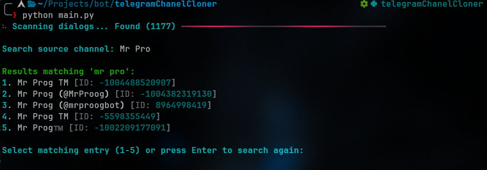
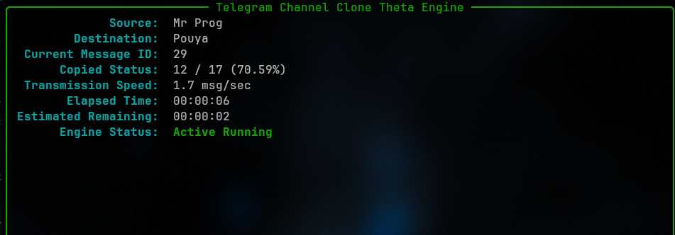

# 🚀 Telegram Channel Clone Theta (v0.0.5)

An ultra-resilient, production-grade asynchronous CLI application built with **Python 3.12+** and **Telethon** to seamlessly clone message histories from any accessible Telegram channel, group, or **Saved Messages** to a destination channel/group.

## ⚡ Quick Overview

Cloning massive Telegram channels (10,000+ to 50,000+ messages) often fails due to proxy disconnects, IP changes, rate limits, and frozen sockets. **Telegram Channel Clone Theta** is engineered from the ground up to handle unstable networks with **zero freezing**, **smart chunked pagination**, **auto-reconnection**, and **resumable progress tracking**.

<p align="center">
  
</p>

<p align="center">
  
</p>

## 🌟 Key Features

- 🔄 **100% Chronological Execution**: Copies messages strictly from oldest to newest, preserving historical sequence perfectly.
- 🛡️ **Zero-Freezing Network Resilience**: Hard socket recovery mechanism that auto-reconnects on IP changes or proxy drops without freezing.
- 🌐 **HTTP Proxy Support**: Built-in HTTP proxy support powered by `python-socks` for bypass and secure operations.
- 💬 **Saved Messages Integration**: Clone directly to or from your personal "Saved Messages" using simple keywords (`saved`).
- 🔍 **Single-Pass Fast Search**: Caches all accessible dialogs once with a live scanning progress bar for instant searching.
- ✏️ **Text Cleaning, Auto Replacement & Signatures**: Auto-replace channel handles, remove custom text/patterns, and inject custom headers or footers.
- 📂 **Full Media & Album Compatibility**: Handles Text, Photos, Videos, Media Groups (Albums), Voice, GIFs, Documents, Stickers, Locations, Contacts, and Round Videos.
- 🎛️ **Advanced Filtering Options**: Restrict cloning by allowed media types, max file size limits (e.g., max 50MB), Date Ranges (`YYYY-MM-DD`), or Message ID boundaries.
- 📌 **Pinned Messages & Forum Topics**: Syncs pinned messages automatically and supports Telegram Supergroup Forum Topics (Threads).
- ⏳ **Human Delay Jitter**: Configurable random delay between messages for natural behavior to stay safe under Telegram's rate limit policies.
- 📊 **Live Rich CLI Dashboard**: Real-time terminal UI displaying copy speed, estimated time remaining (ETA), message count, and status alerts.
- ⚙️ **FloodWait & Error Isolation**: Gracefully sleeps on Telegram rate limits and logs missing/failed items without crashing.
- 💾 **Resumable Progress**: Saves state after every successfully copied message and resumes anytime from where you left off.

---

## 💻 Installation & Setup Guide

### 📋 Prerequisites

Before installing, ensure your system meets the following requirements:
- **Python**: Version `3.12` or higher ([python.org](https://www.python.org/downloads/)).
- **Git**: Installed on your system ([git-scm.com](https://git-scm.com/)).
- **Telegram Account**: Access to your account to obtain API credentials.

---

### 🔑 Step 1: Obtain Telegram API Credentials

To allow Telethon to connect securely to the Telegram network:
1. Log in to your account at [my.telegram.org](https://my.telegram.org).
2. Go to **API development tools**.
3. Create a new application (fill in a dummy App Title and Short Name).
4. Copy your unique **`api_id`** (an integer) and **`api_hash`** (a 32-character string).

---

### 🐧 Step 2A: Installation on Linux / macOS / Android
Open your terminal and execute the following commands step-by-step:
##### Android users can run the application directly on their phones using **Termux** (recommended to install from [F-Droid](https://f-droid.org/en/packages/com.termux/)):
#### 1. Clone the Repository
```Bash
git clone [https://github.com/MR-PR0G/Telegram-channel-cloner.git](https://github.com/MR-PR0G/Telegram-channel-cloner.git)
cd Telegram-channel-cloner
```
#### 2. Create & Activate Virtual Environment
```Bash
# Create virtual environment
python3 -m venv venv

# Activate virtual environment
source venv/bin/activate
```
#### 3. Install Required Dependencies
```Bash
pip install --upgrade pip
pip install -r requirements.txt
```
### 🪟 Step 2B: Installation on Windows

Open Command Prompt (cmd) or PowerShell and execute:
#### 1. Clone the Repository
```DOS
git clone [https://github.com/MR-PR0G/Telegram-channel-cloner.git](https://github.com/MR-PR0G/Telegram-channel-cloner.git)
cd Telegram-channel-cloner
```
#### 2. Create & Activate Virtual Environment
```DOS
# Create virtual environment
python -m venv venv

# Activate in Command Prompt (CMD)
venv\Scripts\activate

# OR Activate in PowerShell
.\venv\Scripts\Activate.ps1
```
#### 3. Install Required Dependencies
```DOS

python -m pip install --upgrade pip
pip install -r requirements.txt
```
### ⚙️ Step 3: Configure config.py

Open config.py using your preferred code editor (VS Code, Nano, Notepad, etc.) and enter your Telegram API credentials:
Python
```
# Replace with your credentials from my.telegram.org
API_ID = 12345678            # Replace with your integer API ID
API_HASH = "your_api_hash"   # Replace with your string API HASH

# Optional Proxy Configuration
USE_PROXY = False            # Set to True to enable proxy
PROXY_HOST = "127.0.0.1"     # Your proxy IP / Host
PROXY_PORT = 8080            # Your proxy Port
```
### 🚀 Step 4: Run the Application

Ensure your virtual environment is active, then launch:
```Bash
python main.py
```
---

## 🚀 Execution Workflow & Interactive Usage

Once you run `python main.py`, the application initiates an interactive, step-by-step CLI workflow designed for ease of use:

### 🔄 Step-by-Step Workflow

1. **🔒 Secure Authentication**
   - The app prompts for your phone number (international format, e.g., `+989123456789`).
   - Enter the login code sent to your Telegram app.
   - If **Two-Factor Authentication (2FA)** is enabled, securely input your cloud password (characters will be hidden for privacy).

2. **🔍 Intelligent Dialog Scanning & Caching**
   - The engine performs a single-pass fast scan of all your accessible chats, channels, and groups.
   - A live progress bar will display the scan percentage and the total number of cached dialogs.

3. **📥 Source Selection**
   - Type a keyword to search for your source channel/group (e.g., `linux`, `crypto`).
   - Alternatively, type `saved` to select your official Telegram **Saved Messages** space.
   - Select the corresponding index number from the search results grid.

4. **📤 Destination Selection**
   - Search and select your target destination using the same interactive keyword search.
   - You can also choose `saved` as a target if you wish to clone a channel's history into your personal Saved Messages.

5. **📊 Live Analytics Dashboard**
   - The application fetches the total message count from the source, prepares the chronological queue, and spins up a real-time terminal UI showing:
     - Current copying progress (e.g., `142 / 5000 messages`)
     - Transfer Speed & Estimated Time of Arrival (ETA)
     - Success/Failure counters and automatic FloodWait sleep notices.

---

## 🛠️ Feature Tuning: How to Use `config.py` Effectively

The `config.py` file is packed with robust features. Below is a quick tactical guide on how to configure them to match your exact use-case:

### 🛡️ 1. Maximizing Account Safety (Anti-Ban Measures)
Telegram monitors high-speed automated accounts. To make your cloning bot look completely human:
* **Enable Jitter:** Set `ENABLE_RANDOM_DELAY = True`.
* **Tune Intervals:** Keep `MIN_DELAY = 0.2` and `MAX_DELAY = 0.8`. This introduces a chaotic, human-like delay pattern between posts, safely shielding your account from harsh `FloodWait` penalties.

### ✏️ 2. Content Cleaning & Automated Re-Branding
If you are cloning a public channel to your own private/public channel, you probably want to clean up advertising links and signatures:
* **Auto Handle Swap:** Set `AUTO_REPLACE_USERNAMES = True`. The script automatically scans messages for any username handles matching the source channel (e.g., `@old_channel`) and overwrites them with your new destination handle (e.g., `@new_channel`).
* **Custom Signatures:** Use `CUSTOM_HEADER` and `CUSTOM_FOOTER` to enforce global branding. For example:
  ```python
  CUSTOM_FOOTER = "\n\n🌐 **Join our main hub:** @my_awesome_destination"
  ```
* **Advanced Stripping:** Populate `REMOVE_PATTERNS` with exact text blocks or Regex expressions to delete annoying promotional tags or link shorteners automatically.

### 📂 3. Bandwidth Optimization & Media Filtering
Don't want to waste gigabytes of data on heavy movies, archives, or specific formats? 
* **Size Cap:** Set `MAX_FILE_SIZE_MB = 50.0`. Any video, document, or audio file exceeding 50 megabytes will be skipped, but its accompanying text message will still be copied seamlessly.
* **Target Specific Formats:** Modify the `ALLOWED_MEDIA_TYPES` list. If you only care about text and pictures, strip down the array:
  ```python
  ALLOWED_MEDIA_TYPES = ["text", "photo"]
  ```

### 📅 4. Historical Scoping (Date & ID Ranges)
Instead of copying a channel's entire 5-year history, you can narrow down the operation window:
* **Date Bounds:** Set `START_DATE = "2026-01-01"` and `END_DATE = "2026-07-01"` to isolate and extract logs only from that specific timeframe.
* **ID Isolation:** Set `MIN_MSG_ID` and `MAX_MSG_ID` to replicate a specific range of message IDs.

### 💬 5. Supergroup Forums & Thread Syncing
Modern Telegram communities use structured Forum Topics. Theta fully supports cloning directly inside specific threads:
* Map target threads by passing their unique topic IDs into `SOURCE_TOPIC_ID` and `DESTINATION_TOPIC_ID`. (Leave them as `None` for standard linear channels).

---

## 💾 Session Reliability & Auto-Resume

Network drops, proxy time-outs, and unexpected machine reboots are inevitable during huge migrations. Theta handles this gracefully:
* Every single successfully cloned message updates a state file called `progress.json`.
* If the app is terminated, simply rerun `python main.py`. 
* The system will detect the active checkpoint, read your source/destination logs, and give you an interactive prompt to **Resume from exactly where you left off**, guaranteeing zero double-posts or lost messages.
 ‍‍---
  
## ❓ Troubleshooting & FAQ
Below are solutions to common runtime issues and error messages encountered when using Telethon and Telegram API:

<details>
<summary><b>1. <code>FloodWaitError: A wait of X seconds is required</code></b></summary>

- **Cause:** Telegram strictly enforces API request rate limits.
- **Solution:** Theta automatically detects `FloodWaitError`, pauses execution safely for `X` seconds, and resumes without losing progress. To reduce the likelihood of encountering FloodWait:
  - Set `ENABLE_RANDOM_DELAY = True` in `config.py`.
  - Increase `MIN_DELAY` and `MAX_DELAY` values (e.g., `0.5` and `1.5`).
</details>

<details>
<summary><b>2. <code>sqlite3.OperationalError: database is locked</code></b></summary>

- **Cause:** Another instance of `main.py` or a Telethon process is actively using the `.session` file in the `session/` folder.
- **Solution:** Close all other terminal sessions or background python processes using the session file, then re-launch `python main.py`.
</details>

<details>
<summary><b>3. <code>ChannelPrivateError</code> / <code>ChatAdminRequiredError</code></b></summary>

- **Cause:** You are trying to clone from a private channel you haven't joined, or trying to send posts to a destination channel where your account lacks admin publishing privileges.
- **Solution:**
  - Ensure your Telegram account is an active member/subscriber of the source channel.
  - Make sure your account has **"Post Messages"** admin permission in the destination channel.
</details>

<details>
<summary><b>4. Proxy Connection Errors (e.g., <code>python_socks.GeneralProxyError</code>)</b></summary>

- **Cause:** Invalid proxy IP, port, or proxy server downtime.
- **Solution:**
  - Verify your proxy server is running locally or remotely (e.g., test IP/port `127.0.0.1:2080`).
  - If you are not using a proxy, ensure `USE_PROXY = False` in `config.py`.
  - Ensure `python-socks` dependency is installed (`pip install python-socks`).
</details>

<details>
<summary><b>5. <code>SessionPasswordNeededError</code></b></summary>

- **Cause:** Two-Factor Authentication (2FA) is enabled on your Telegram account.
- **Solution:** When prompted by the CLI, enter your 2FA Cloud Password. Password inputs are masked automatically for privacy.
</details>

<details>
<summary><b>6. <code>ModuleNotFoundError: No module named 'rich'</code> (or 'telethon')</b></summary>

- **Cause:** The virtual environment is either not activated or missing required dependencies.
- **Solution:** Activate your virtual environment and run the dependency installer:
  ```bash
  source venv/bin/activate  # On Linux/macOS
  .\venv\Scripts\activate   # On Windows
  pip install -r requirements.txt
  ```
</details>
<details>
<summary><b>7. How do I find Topic IDs for Telegram Supergroup Forums?</b></summary>

* **Solution:**
  1. Open Telegram Desktop and navigate to your Supergroup Forum.
  2. Right-click on any post inside the specific topic and select **Copy Post Link**.
  3. The link format is `https://t.me/c/123456789/TOPIC_ID/MSG_ID`.
  4. Extract the middle integer (`TOPIC_ID`) and paste it into `SOURCE_TOPIC_ID` or `DESTINATION_TOPIC_ID` in `config.py`.
</details>

---

## 🤝 Contributing & Support

Contributions, bug reports, and feature requests are welcome!

- Give a ⭐️ **Star** if this project helped you!
- Feel free to open an **Issue** or submit a **Pull Request**.

### Designed with ❤️ by [MR-PR0G](https://github.com/MR-PR0G)

---
## 🏗️ Project Architecture & Developer Guide

### 📂 Directory Structure
```
telegram-channel-cloner/
├── config.py           # Master configuration parameters & settings
├── main.py             # CLI entry point and execution coordinator
├── requirements.txt    # Python dependencies
├── LICENSE             # MIT License file
├── README.md           # Documentation
└── src/
    ├── __init__.py          # Package initializer
    ├── authentication.py    # Telethon client session & 2FA authentication
    ├── cloner.py            # Core async cloning engine & live Rich CLI interface
    ├── dialog_search.py     # Dialog caching, filtering & interactive CLI search
    ├── logger.py            # Loguru logger setup
    ├── media.py             # Media classification and album (grouped_id) helpers
    ├── message_handler.py   # Message processing, text cleaning & metadata mapping
    ├── progress.py          # State tracking, progress persistence & crash recovery
    ├── sender.py            # Safe transmission wrappers (FloodWait handling, topic routing)
    └── utils.py             # Text replacement, date filters, and delay jitter
```

---

### 🔄 System Architecture & Data Flow

1. **Initialization (`main.py` & `authentication.py`)**:
   The CLI boots up, initializes logging via `logger.py`, and authenticates the user using Telethon.

2. **Dialog Discovery (`dialog_search.py`)**:
   Scans all user dialogs in a single pass with a live `Rich` progress bar, caching chats and `Saved Messages` for immediate indexed search.

3. **Batch Orchestration (`cloner.py`)**:
   Retrieves history chronologically in chunked batches (`get_messages`), accumulates media groups (albums), and updates a live dashboard.

4. **Message Transformation (`message_handler.py` & `utils.py`)**:
   Evaluates date bounds, file size constraints, and media rules. Applies text modifications (username handles, regex patterns, custom headers/footers).

5. **Resilient Transmission (`sender.py`)**:
   Dispatches messages to the destination entity or specific forum topic. Handles rate-limiting (`FloodWaitError`) gracefully and maps original message IDs to cloned message IDs to preserve reply chains.

6. **State Persistence (`progress.py`)**:
   Saves progress to `progress.json` after every successfully copied item for instant session recovery.

